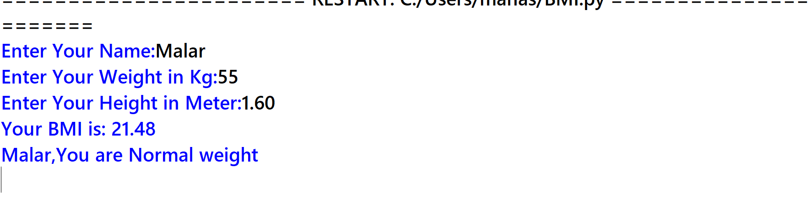

# BMI Calculator

A simple Python program created by **Manasa** that calculates Body Mass Index (BMI) and classifies it into categories.

## 🚀 Features
- Calculates BMI from user input (weight in kg, height in meters)
- Provides BMI category:
  - Underweight
  - Normal weight
  - Overweight
  - ObeseR
  - Severely Obese
  - Morbidly Obese
- User-friendly input and outputgit 

## 🛠️ How to Run
1. Download or clone the repository:
   ```bash
   git clone https://github.com/Maanu-Hue/BMI-calculator.git

   ## 📊 Example Output

 ### Terminal Run Screenshot
>> 
